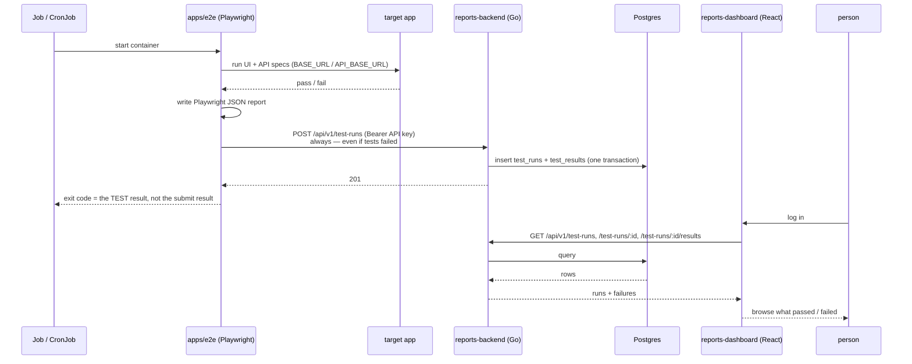

# geronimo

Geronimo runs an end-to-end Playwright test suite against a deployed application stack — UI flows and direct API calls, things like creating a user, logging in, exercising a test account — inside Kubernetes, on both a post-deploy `Job` and a recurring `CronJob`. Every run's Playwright JSON report is pushed into a small reports system so failures can be reviewed later instead of only existing in ephemeral pod logs.

It is three small services plus a Helm chart, not one big app:

- **`apps/e2e`** — the Playwright suite itself. Runs UI (`tests/ui`) and API (`tests/api`) specs against a configurable target, then submits its JSON report.
- **`apps/reports-backend`** — a Go/Postgres API that stores and serves those reports. It's a fork of [`git-single-tenant-template`](https://github.com/miguelrosalesmtl/git-single-tenant-template), extended with one new resource (`test_runs`/`test_results`) — accounts, sessions, RBAC, API keys, and an audit log all came from the template for free.
- **`apps/reports-dashboard`** — a React UI for browsing runs and failures. A fork of [`frontend-template`](https://github.com/miguelrosalesmtl/frontend-template), extended with a `testruns` feature slice.
- **`apps/target-app`** — a throwaway Django admin app (SQLite, one seeded user) that exists purely so `apps/e2e` has something real to log into locally. Not a stand-in for whatever real application eventually gets tested in a cluster.
- **`charts/geronimo`** — the Helm chart that deploys the `Job`/`CronJob` and the reports system together.

## How a run flows through the system



The one rule that shapes `apps/e2e/entrypoint.sh`: a failing test run must still be submitted. The container never lets a successful submission mask a test failure, and never lets a submission failure silently drop a report — see the script itself for the exact exit-code logic.

## Repo layout

```
apps/
  e2e/                 Playwright suite (UI + API projects), report parser + submitter,
                        entrypoint.sh, Dockerfile — this is the Job/CronJob image
  reports-backend/     forked from git-single-tenant-template; internal/testruns/ is the
                        new package, everything else (accounts/RBAC/API-keys/audit) is
                        the template as-is
  reports-dashboard/   forked from frontend-template; src/features/testruns/ is the new
                        feature slice, everything else is the template as-is
  target-app/          throwaway Django admin app, a local e2e target only
charts/geronimo/        Helm chart: Job + CronJob for apps/e2e, Deployments for the
                        reports backend/dashboard, an optional bundled dev-grade Postgres
docs/architecture.md    the wire contract between apps/e2e and reports-backend
docker-compose.yml      the whole stack, for local dev
```

## Local dev

```sh
docker compose up --build        # target-app + reports-postgres + reports-backend + reports-dashboard
open http://localhost:8091       # reports-dashboard
```

Bootstrap a service account for `apps/e2e` to authenticate with (one-time; see `apps/reports-backend`'s own README for the CLI commands):

```sh
docker compose exec reports-backend /app/server grant-role ci-bot@geronimo.local admin
# log in as ci-bot, POST /api/v1/api-keys with permissions:["testruns.create"], keep the key
```

Run the e2e suite against the local target-app (or any other reachable target):

```sh
cd apps/e2e
BASE_URL=http://localhost:8000 API_BASE_URL=http://localhost:8000 TARGET_ENV=local \
REPORTS_API_URL=http://localhost:8090 REPORTS_API_KEY=<the key above> \
  ./entrypoint.sh
```

## Kubernetes

```sh
helm install geronimo charts/geronimo -n geronimo --create-namespace \
  --set target.baseUrl=https://staging.example.com \
  --set target.apiBaseUrl=https://staging.example.com/api
```

See `charts/geronimo/values.yaml` and the chart's `NOTES.txt` (printed on install) for the one-time service-account bootstrap step and the CORS gotcha it warns about (`reports-dashboard` is a browser SPA calling `reports-backend` cross-origin — CORS is off by default in the forked backend template and has to be pointed at wherever the dashboard is actually reachable).

### Triggering via ArgoCD

We deploy through ArgoCD, so the e2e `Job` (`charts/geronimo/templates/job-e2e-run.yaml`) is set up to run automatically right after every sync — no separate CI step needed to fire it. It carries both:

- `helm.sh/hook: post-install,post-upgrade` — ArgoCD recognizes standard Helm hook annotations on a Helm-sourced Application and maps `post-install`/`post-upgrade` to its own `PostSync` phase automatically.
- `argocd.argoproj.io/hook: PostSync` — the same thing, spelled out explicitly, so it's true by reading the annotation rather than relying on that implicit mapping.

Net effect: whenever the target application's own ArgoCD `Application` syncs a new version (merge → image/manifest update → ArgoCD detects drift → syncs), the e2e suite runs right after, against the version that's now actually live — not just "recently merged." `argocd.argoproj.io/hook-delete-policy: BeforeHookCreation` keeps the previous run's Job around for `kubectl logs`/debugging until the next one starts, matching `helm.sh/hook-delete-policy` for plain Helm installs.

The `CronJob` (`cronjob-e2e-run.yaml`) is unaffected by any of this — it keeps running on its own schedule regardless of how or whether a sync happened.

## Status

Everything above is built and verified end to end locally: a real Playwright run against `target-app` produces a JSON report that gets parsed, submitted, stored, and queried back out of a real `reports-backend` + Postgres — including the failure path (a broken test still gets ingested, with its error message and stack trace intact). `reports-dashboard` has real login wired up (its own session against `reports-backend`, not mocked) — an unauthenticated visitor is redirected to `/login`, and a signed-in one sees real stored runs.
